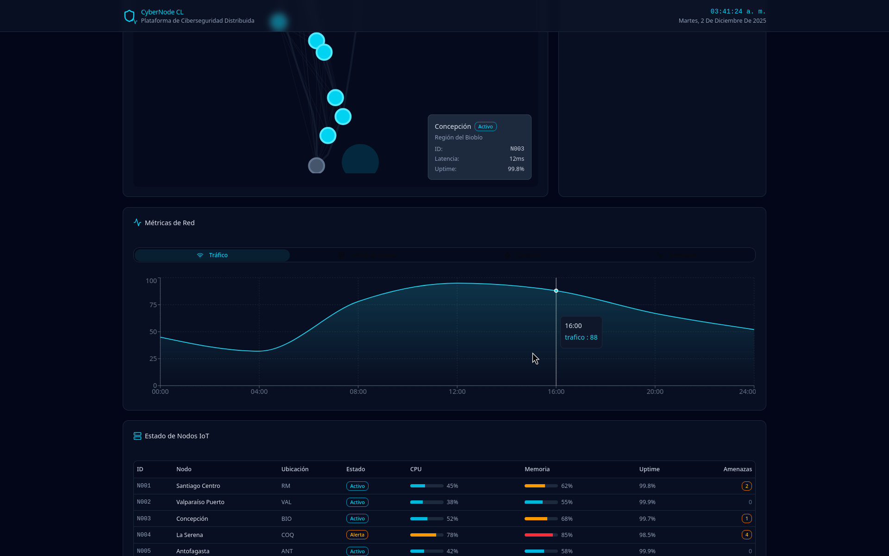
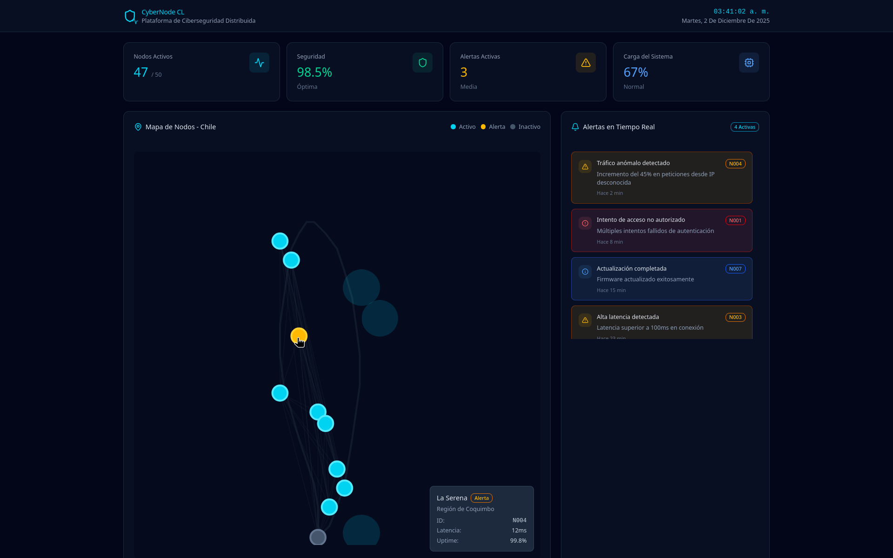

# Dashboard CyberNode CL

CyberNode is a concept of a **node monitoring web dashboard** created for an Innovation module.  
The UI was generated and refined using the Figma AI tools and exported as a React + Vite project. :contentReference[oaicite:1]{index=1}

## Tech stack

- React 18 + TypeScript
- Vite
- Radix UI + custom components
- Recharts for charts

## Running locally

<h3>On your terminal</h3> 
	npm install
	npm run dev

The app will be available at http://localhost:5173 (or whatever Vite prints in the terminal)

## "Production Build" \*

<h3>On your terminal</h3>
	npm build

This generates the static site in the build/ folder, ready to be deployed to any static host (Netlify, Vercel, etc.).

\*Discourage: this is intended only as a showcase. If u want to fork, be free at your own risk, wanrs should be consider made.

## Notes

This project is a visual prototype of a cybersecurity monitoring dashboard.
It focuses on layout, interactions and data visualization rather than real backend integration.
